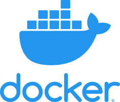

---

**Docker** is an open platform for developing, shipping, and running applications. It essentially is a container runtime. A _container runtime_ is software that executes containers and manages container images on a node. Today, the most widely known container runtime is Docker, but there are other container runtimes in the ecosystem, such as rkt, containerd, and lxd. Docker is by far the most common container runtime used in production environments. 

Docker provides the ability to package and run an application in a loosely isolated environment called a container. The isolation and security allow you to run many containers simultaneously on a given host. Containers are lightweight because they don’t need the extra load of a hypervisor, but run directly within the host machine’s kernel. This means you can run more containers on a given hardware combination than if you were using virtual machines. You can even run Docker containers within host machines that are actually virtual machines!

Docker provides tooling and a platform to manage the lifecycle of your containers:

* Develop your application and its supporting components using containers.
* The container becomes the unit for distributing and testing your application.
* When you’re ready, deploy your application into your production environment, as a container or an orchestrated service. This works the same whether your production environment is a local data center, a cloud provider, or a hybrid of the two.

In simple words, Docker is a containerization platform that packages your application and all its dependencies together in the form of Containers to ensure that your application works seamlessly in any environment.

## Docker Engine

Docker Engine is a client-server application with these major components:

* A server which is a type of long-running program called a daemon process (the dockerd command).
* A REST API which specifies interfaces that programs can use to talk to the daemon and instruct it what to do.
* A command line interface (CLI) client (the `docker` command).

Docker Engine enables containerized applications to run anywhere consistently on any infrastructure, solving “dependency hell” for developers and operations teams, and eliminating the “it works on my laptop!” problem.

The Docker daemon (dockerd) listens for Docker API requests and manages Docker objects such as images, containers, networks, and volumes. 

The Docker _client_ talks to the Docker daemon, which does the heavy lifting of building, running, and distributing your Docker containers. The Docker client and daemon can run on the same system, or you can connect a Docker client to a remote Docker daemon. The Docker client and daemon communicate using a REST API, over UNIX sockets or a network interface.

The Docker client (docker) is the primary way that many Docker users interact with Docker. The `docker` command uses the Docker API. The Docker client can communicate with more than one daemon.

Get started with creation of installing Docker by clicking [here](install-docker.md).