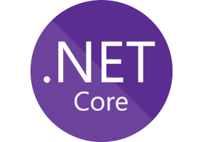

---

**.Net Core** is an open source, multi-platform, and multi-purpose runtime for .Net applications developed by Microsoft.

With .Net Core you can build console and web applications using a variety of languages, like C# and F# and run them in Windows, Mac, Linux or Docker.

Get started with creating your .Net Core application by clicking [here](/netcore/create-first-dotnetcore-console-app-on-ubuntu.md).