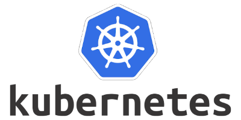

---

**Kubernetes** (K8s) is an open-source system for automating deployment, scaling, and management of containerized applications.

The name Kubernetes originates from Greek, meaning helmsman or pilot. Google open-sourced the Kubernetes project in 2014.

Get started with creation of single node Kubernetes cluster by clicking [here](single-node-k8s-ubuntu-gcp-kubeadm.md).